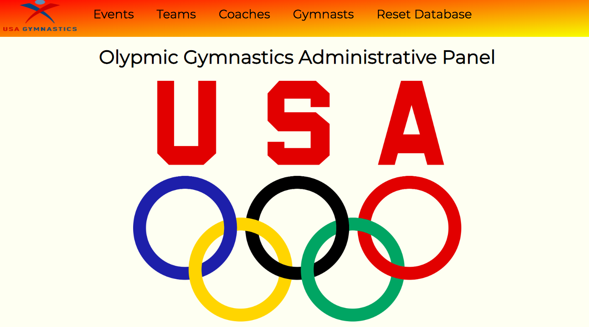

# Welcome to the USA Gymnastics Admin Panel
[Demonstration](https://www.youtube.com/watch?v=RZgKACrUnts)

[Try it out!](https://gymnastics-panel.herokuapp.com/)

The United States leads the world in Olympic Gymnastics. This administrative panel was developed for the USA Gymnastics Association to easily manage and visualize data regarding gymnasts, coaches, olympic teams and events. Administrators have the ability to register gymnasts and coaches.

Somethings about the app
* Built on Ruby on Rails
* PostgreSQL and ActiveRecord utilized for complex database relationships creating  full CRUD functionality for all models
* Created Custom Rake Tasks allowing user to make complex database alterations either through front end interaction or daily via Heroku Scheduler
* Used MVC Model  via AJAX calls to reflect database changes without reloading the page
* Utilized CSS Flexbox for mobile responsiveness

